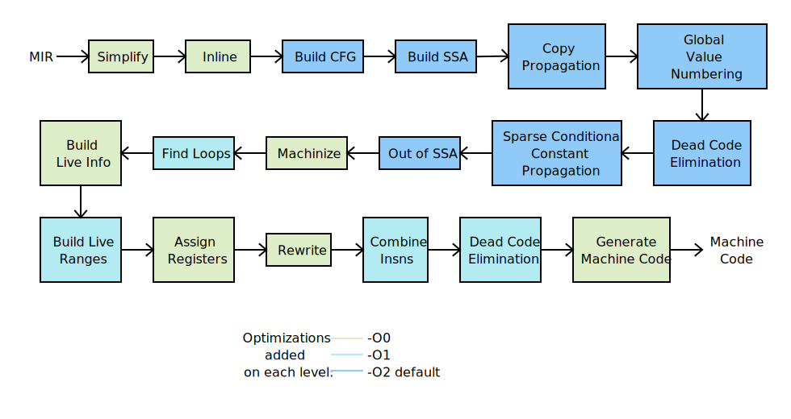
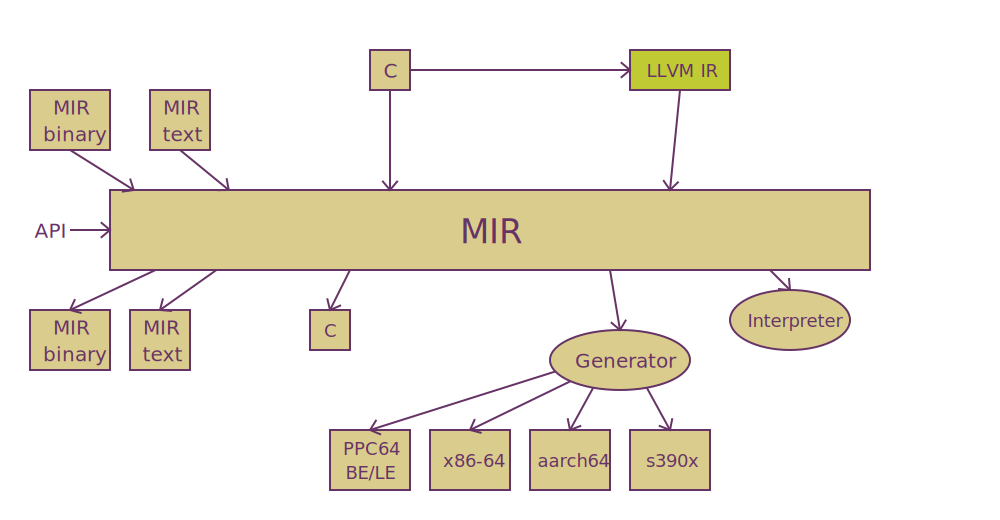
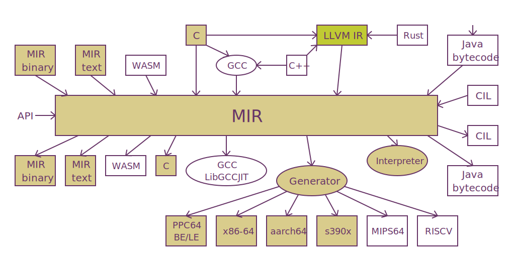

# MIR

## Rust MIR

Docs: [https://rust-lang.github.io/rfcs/1211-mir.html](https://rust-lang.github.io/rfcs/1211-mir.html)

```
MIR = fn({TYPE}) -> TYPE {
    {let [mut] B: TYPE;}  // user-declared bindings and their types
    {let TEMP: TYPE;}     // compiler-introduced temporary
    {BASIC_BLOCK}         // control-flow graph
};

BASIC_BLOCK = BB: {STATEMENT} TERMINATOR

STATEMENT = LVALUE "=" RVALUE        // assign rvalue into lvalue
          | Drop(DROP_KIND, LVALUE)  // drop value if needed
DROP_KIND = SHALLOW                  // (see discussion below)
          | DEEP

TERMINATOR = GOTO(BB)              // normal control-flow
           | PANIC(BB)             // initiate unwinding, branching to BB for cleanup
           | IF(LVALUE, BB0, BB1)  // test LVALUE and branch to BB0 if true, else BB1
           | SWITCH(LVALUE, BB...) // load discriminant from LVALUE (which must be an enum),
                                   // and branch to BB... depending on which variant it is
           | CALL(LVALUE0 = LVALUE1(LVALUE2...), BB0, BB1)
                                   // call LVALUE1 with LVALUE2... as arguments. Write
                                   // result into LVALUE0. Branch to BB0 if it returns
                                   // normally, BB1 if it is unwinding.
           | DIVERGE               // return to caller, unwinding
           | RETURN                // return to caller normally
           
LVALUE "=" RVALUE

LVALUE = B                   // reference to a user-declared binding
       | TEMP                // a temporary introduced by the compiler
       | ARG                 // a formal argument of the fn
       | STATIC              // a reference to a static or static mut
       | RETURN              // the return pointer of the fn
       | LVALUE.f            // project a field or tuple field, like x.f or x.0
       | *LVALUE             // dereference a pointer
       | LVALUE[LVALUE]      // index into an array (see disc. below about bounds checks)
       | (LVALUE as VARIANT) // downcast to a specific variant of an enum,
                             // see the section on desugaring matches below

RVALUE = Use(LVALUE)                // just read an lvalue
       | [LVALUE; LVALUE]
       | &'REGION LVALUE
       | &'REGION mut LVALUE
       | LVALUE as TYPE
       | LVALUE <BINOP> LVALUE
       | <UNOP> LVALUE
       | Struct { f: LVALUE0, ... } // aggregates, see section below
       | (LVALUE...LVALUE)
       | [LVALUE...LVALUE]
       | CONSTANT
       | LEN(LVALUE)                // load length from a slice, see section below
       | BOX                        // malloc for builtin box, see section below
BINOP = + | - | * | / | ...         // excluding && and ||
UNOP = ! | -                        // note: no `*`, as that is part of LVALUE

CONSTANT = INT
         | UINT
         | FLOAT
         | BOOL
         | BYTES
         | STATIC_STRING
         | ITEM<SUBSTS>                 // reference to an item or constant etc
         | <P0 as TRAIT<P1...Pn>>       // projection
         | CONSTANT(CONSTANT...)        // 
         | CAST(CONSTANT, TY)           // foo as bar
         | Struct { (f: CONSTANT)... }  // aggregates...
         | (CONSTANT...)                //
         | [CONSTANT...]                //
```

## Common MIR

[https://github.com/vnmakarov/mir](https://github.com/vnmakarov/mir)



Current:



Future Plan:



```c
#define Size 819000
int sieve (int N) {
  int64_t i, k, prime, count, n; char flags[Size];

  for (n = 0; n < N; n++) {
    count = 0;
    for (i = 0; i < Size; i++)
      flags[i] = 1;
    for (i = 0; i < Size; i++)
      if (flags[i]) {
        prime = i + i + 3;
        for (k = i + prime; k < Size; k += prime)
          flags[k] = 0;
        count++;
      }
  }
  return count;
}
void ex100 (void) {
  printf ("sieve (100) = %d\", sieve (100));
}
```

to MIR:

```asm
m_sieve:  module
          export sieve
sieve:    func i32, i32:N
          local i64:iter, i64:count, i64:i, i64:k, i64:prime, i64:temp, i64:flags
          alloca flags, 819000
          mov iter, 0
loop:     bge fin, iter, N
          mov count, 0;  mov i, 0
loop2:    bge fin2, i, 819000
          mov u8:(flags, i), 1;  add i, i, 1
          jmp loop2
fin2:     mov i, 0
loop3:    bge fin3, i, 819000
          beq cont3, u8:(flags,i), 0
          add temp, i, i;  add prime, temp, 3;  add k, i, prime
loop4:    bge fin4, k, 819000
          mov u8:(flags, k), 0;  add k, k, prime
          jmp loop4
fin4:     add count, count, 1
cont3:    add i, i, 1
          jmp loop3
fin3:     add iter, iter, 1
          jmp loop
fin:      ret count
          endfunc
          endmodule
m_ex100:  module
format:   string "sieve (10) = %d\n"
p_printf: proto p:fmt, i32:result
p_sieve:  proto i32, i32:iter
          export ex100
          import sieve, printf
ex100:    func v, 0
          local i64:r
          call p_sieve, sieve, r, 100
          call p_printf, printf, format, r
          endfunc
          endmodule
```
